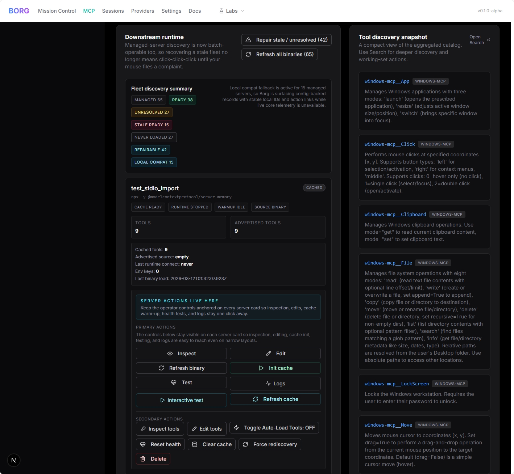

# Borg (v2.7.333)

> The Unified AI Operations Control Plane.


Borg is a high-performance local control plane designed to sit between AI agents and their underlying infrastructure. It transforms standard agent interactions into a sophisticated, multi-tiered cognitive workflow with integrated memory, real-time observability, and autonomous "auto-drive" capabilities.

---

## 🚀 Key Capabilities

### 🧠 Advanced Multi-Tier Memory
Borg implements a sophisticated memory architecture inspired by `Mem0` and `Letta`, ensuring agents never "forget" across sessions:
- **Automatic Context Harvesting**: Borg silently extracts facts, concepts, and technical entities from every conversation and tool execution.
- **LanceDB Vector Storage**: High-speed local vector database for long-term semantic retrieval.
- **Graph-Based Knowledge**: Tracks relationships between files, tasks, and concepts via `GraphMemory`, allowing for high-level architectural reasoning.
- **Context Compacting & Pruning**: Automatically compresses chat history and prunes redundant data to maintain optimal context window efficiency.

### ⚡ One-Shot Discovery & Execution
The "Meta-Tool" architecture eliminates the turn-latency of traditional tool use:
- **`auto_call_tool`**: Describe an objective in plain language; Borg searches for the right tool, maps arguments using a background LLM, and executes it in a single step.
- **Dynamic Advertising**: Borg only advertises core Meta-Tools by default to stay under LLM limits. It summons the full power of hundreds of MCP tools on-demand.

### 🌐 Universal MCP Master Router
Aggregate hundreds of MCP servers behind one endpoint. Borg manages connections, tool conflicts, and namespacing automatically.



### 👁️ Real-Time "Local LLM" Watcher
Borg runs background "Copilot" logic through the `SuggestionService`:
- **Preemptive Injection**: As you browse code or chat, Borg semantically predicts your next move and injects clickable tool suggestions into the UI.
- **Thematic Comprehension**: Understands when you are debugging, researching, or refactoring, and surface relevant skills/tools automatically.

### 🚑 Auto-Drive & Autonomous Healing
The `Director` and `HealerService` provide a safety net for autonomous operations:
- **Conversation Monitoring**: A background daemon watches chat logs and terminal outputs.
- **Self-Healing**: When a test fails or a process crashes, the Healer analyzes the stack trace, generates a fix, and proposes it for approval.
- **Handoff & Pickup**: Automatically summarizes sessions into "Bootstrap Prompts" so agents can resume work exactly where they left off.

---

## 📖 How to Use Borg

### 1. Connect your AI Agent
Borg acts as a standard MCP server that routes to all other servers. Connect your preferred AI (Claude Desktop, VS Code, etc.) to the Borg entry point:

**Standard Stdio Connection:**
```json
{
  "mcpServers": {
    "borg": {
      "command": "node",
      "args": ["/path/to/borg/packages/core/dist/index.js"]
    }
  }
}
```

### 2. The "One-Shot" Workflow (Recommended)
Instead of asking the model to find a tool, give it the objective directly. Borg will handle the discovery and execution in one turn.

*   **Agent Call**: `auto_call_tool({ objective: "Search my emails for the invoice from last Tuesday and save it to the project folder", context: "Tuesday was March 10th" })`
*   **Borg Action**: Automatically finds the `gmail` and `filesystem` tools, maps the arguments, and executes.

### 3. The Discovery Workflow
If you want to manually manage your active tools:
1.  **Search**: `search_tools({ query: "how do I interact with jira?" })`
2.  **Load**: `load_tool({ name: "jira__create_issue" })`
3.  **Execute**: Use the newly hydrated tool normally.

### 4. Mission Control Dashboard
Open `http://localhost:3001/dashboard` to:
- **Toggle Functions**: Instantly enable/disable any sidebar feature or MCP integration.
- **Monitor Swarms**: See live logs and memory graphs of all active agent sessions.
- **Manage Quotas**: View LLM provider spend and health in one place.

---

## 🏗️ Core Architecture

1. **Discovery**: `search_tools(query)` -> Semantic ranked matches.
2. **Loading**: `load_tool(name)` -> Hydrates specific tool schemas.
3. **Execution**: `auto_call_tool(objective, context)` -> One-shot magic.
4. **Memory**: `save_memory` / `search_memory` -> Persistent cross-session intelligence.

---

## 🏁 Quick Start

### Prerequisites
- Node.js 20+ | `pnpm` 10+
- Docker Desktop (Optional)

### Option A: Docker (Recommended)
```bash
docker compose up --build
```

### Option B: Local Development
```bash
pnpm install
pnpm run dev
```

### Local Git Hygiene (runtime session file)

`packages/cli/.borg-session.json` is updated at runtime (for example `lastHeartbeat`) and can appear as a local change even when source code is clean.

If you want to keep your working tree clean locally, mark it as skip-worktree:

```bash
git update-index --skip-worktree packages/cli/.borg-session.json
```

To undo that local-only behavior later:

```bash
git update-index --no-skip-worktree packages/cli/.borg-session.json
```

---

## 📂 Repository Layout

- `apps/web`: Next.js Mission Control dashboard.
- `apps/borg-extension`: Browser bridge for MCP-to-Web and auto-memory capture.
- `apps/vscode`: VS Code integration for the Borg Control Plane.
- `packages/core`: The core engine, memory manager, and MCP router.
- `packages/cli`: Direct command-line interaction.
- `archive/`: Compressed history and legacy documentation.

---

## ⚖️ License

MIT. See `LICENSE` for details.
