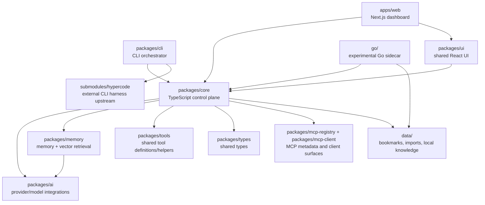
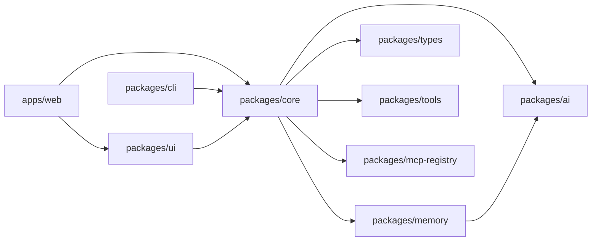
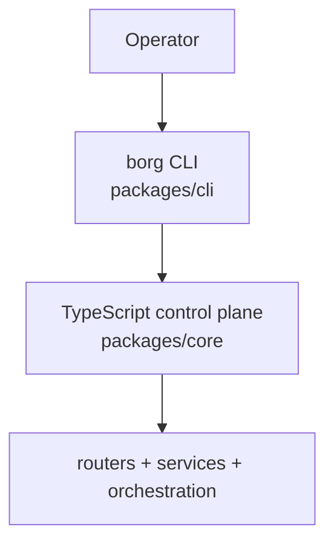
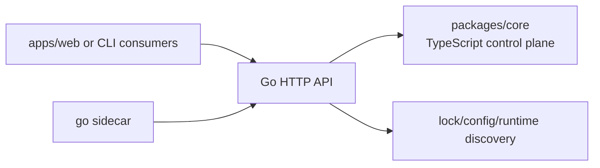
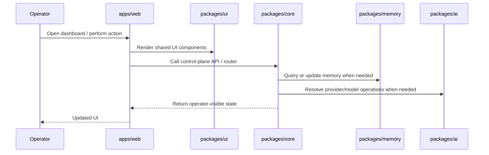
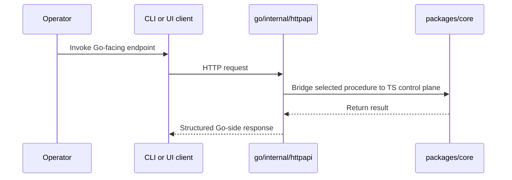

# Project Structure and Module Diagram

This document maps the current structure of the HyperCode/Borg repository, shows where the main modules live, and explains how the major pieces connect.

It is intentionally descriptive rather than aspirational: it focuses on what exists in the repo today.

## 1. High-level shape

HyperCode is a **pnpm monorepo** with four major layers:

1. `apps/` — operator-facing applications and shells
2. `packages/` — shared libraries and the main TypeScript control plane
3. `go/` — experimental Go sidecar and compatibility port
4. `submodules/` plus `data/` — imported external ecosystems and local knowledge assets

At a product level, the repo currently centers on:

- a TypeScript control plane in `packages/core`
- a CLI in `packages/cli`
- a web dashboard in `apps/web`
- a shared UI layer in `packages/ui`
- a memory and retrieval layer in `packages/memory`
- an experimental Go sidecar in `go/`

## 2. Top-level repository map

```text
borg/
├─ apps/                  Operator-facing applications
├─ packages/              Shared libraries and main TypeScript backend
├─ go/                    Experimental Go sidecar / port
├─ cli/                   Legacy/compatibility CLI wrapper area
├─ data/                  Local data assets, bookmarks, imported knowledge
├─ docs/                  Project and contributor documentation
├─ scripts/               Workspace build/dev/maintenance scripts
├─ submodules/            External upstream code assimilated into the repo
├─ archive/               Archived material and retired code/assets
├─ README.md              Product-level overview
├─ ROADMAP.md             Direction and sequencing
├─ TODO.md                Active work tracking
├─ AGENTS.md              Contributor/agent operating rules
├─ package.json           Root scripts and workspace tooling
└─ pnpm-workspace.yaml    Workspace boundaries
```

## 3. Main architectural picture



## 4. Runtime lanes

The repo exposes three main orchestrator identities plus one experimental sidecar:

| Lane | Primary location | Role |
| --- | --- | --- |
| CLI orchestrator | `packages/cli` | Main local terminal entrypoint (`borg`) |
| Web/dashboard lane | `apps/web` | Operator dashboard and API proxy surface |
| Desktop lane | `apps/maestro` | Electron-based desktop shell |
| Experimental Go lane | `go/` | Go sidecar and bridge-first port work |

There is also a nested web stack under `apps/cloud-orchestrator/`, which is its own sub-workspace rather than the primary root dashboard.

## 5. `apps/` — operator-facing applications

### Main apps

| Path | Package name | Purpose |
| --- | --- | --- |
| `apps/web` | `@borg/web` | Main Next.js dashboard and operator UI |
| `apps/maestro` | `maestro` | Desktop Electron shell / desktop orchestrator lane |
| `apps/mobile` | `@borg/mobile` | Mobile-facing surface |
| `apps/cloud-orchestrator` | `jules-ui` | Nested cloud orchestrator stack |
| `apps/borg-extension` | `borg-extension` | Browser extension application |
| `apps/vscode` | `borg-vscode-extension` | VS Code extension app |

### How `apps/` connect

- `apps/web` depends directly on `@borg/core` and `@borg/ui`
- `apps/web` is the main browser-facing dashboard for the TypeScript control plane
- `apps/maestro` is the broader desktop/operator shell
- `apps/cloud-orchestrator` is its own nested ecosystem with its own `apps/`, `packages/`, and `server/`
- extension apps connect editor/browser environments back to the main control-plane concepts

## 6. `packages/` — shared libraries and the main control plane

### Key packages

| Path | Package name | Purpose |
| --- | --- | --- |
| `packages/core` | `@borg/core` | Main TypeScript control plane, routers, services, orchestration |
| `packages/cli` | `@borg/cli` | Main CLI entrypoint and command surface |
| `packages/ui` | `@borg/ui` | Shared React UI components and dashboard widgets |
| `packages/ai` | `@borg/ai` | Model/provider SDK integration layer |
| `packages/memory` | `@borg/memory` | Memory storage, retrieval, embeddings, vector DB integration |
| `packages/types` | `@borg/types` | Shared types |
| `packages/tools` | `@borg/tools` | Tool definitions/helpers |
| `packages/mcp-registry` | `@borg/mcp-registry` | MCP metadata/registry surfaces |
| `packages/mcp-client` | `@borg/mcp-client` | MCP client integration |
| `packages/agents` | `@borg/agents` | Agent-related logic and adapters |
| `packages/adk` | `@borg/adk` | Agent development kit layer |
| `packages/search` | `@borg/search` | Search/indexing support |
| `packages/borg-supervisor` | `@borg/supervisor` | Supervisor-related package |
| `packages/supervisor-plugin` | `@borg/supervisor-plugin` | Supervisor plugin integration |
| `packages/browser` | `@borg/browser-legacy` | Legacy browser support package |
| `packages/browser-extension` | `@borg/browser-extension-pkg` | Browser-extension shared package |
| `packages/claude-mem` | `borg-extension` | Claude/Borg memory-related package surface |
| `packages/vscode` | `borg-vscode-extension` | VS Code shared extension package |
| `packages/mcp-router-cli` | `@borg/mcp-router-cli` | MCP router CLI package |
| `packages/tsconfig` | `@borg/tsconfig` | Shared TS config package |

### The most important dependency chain



### What `packages/core` does

`packages/core` is the hub of the repository.

It contains:

- the TypeScript control plane
- tRPC routers
- MCP server management
- provider routing logic
- session and supervision logic
- memory integration
- orchestration and council-related services
- many operator-facing APIs that the dashboard and CLI call

If you want to understand “where the system comes together,” start in `packages/core`.

## 7. `apps/web` and `packages/ui`

`apps/web` is the main browser dashboard.

It depends on:

- `@borg/core` for control-plane access and route integration
- `@borg/ui` for shared components

`packages/ui` is the shared component layer used to avoid duplicating operator UI across apps. In this repo, the documented convention is that `apps/web` should import shared UI from `@borg/ui`.

## 8. `packages/cli`

`packages/cli` is the main CLI lane and publishes the `borg` command.

It depends on `@borg/core`, so the CLI is not a separate backend; it is another surface over the same TypeScript control-plane concepts.

Conceptually:



## 9. `go/` — experimental sidecar and bridge-first port

The `go/` workspace is a separate Go module:

- module: `github.com/borghq/borg-go`
- top-level layout:
  - `go/cmd/` — Go entrypoints
  - `go/internal/` — Go internal packages and HTTP API

Its role today is **bridge-first** and **coexistence-first**, not full replacement.

In practice, the Go sidecar:

- exposes native Go health/runtime/status surfaces
- mirrors selected operator APIs
- bridges many requests back into the TypeScript control plane
- helps test how much of the operator-facing stack can move into Go safely

### Go sidecar relationship



Important truth: the Go workspace is still an **Experimental** sidecar/port lane, not the sole default runtime for the whole project.

## 10. `apps/cloud-orchestrator/` — nested sub-workspace

`apps/cloud-orchestrator` is effectively its own mini-monorepo inside the main repository.

Observed package surfaces include:

| Path | Package name |
| --- | --- |
| `apps/cloud-orchestrator/package.json` | `jules-ui` |
| `apps/cloud-orchestrator/apps/cli/package.json` | `@jules/cli` |
| `apps/cloud-orchestrator/packages/shared/package.json` | `@jules/shared` |
| `apps/cloud-orchestrator/server/package.json` | `@jules/server` |

This means the repo has:

- the primary HyperCode/Borg workspace at the root
- a nested cloud-orchestrator workspace with its own app/server/shared package structure

That nested stack should be understood as adjacent infrastructure, not the same thing as `apps/web`.

## 11. `submodules/` and external assimilation

One especially important external lane is:

| Path | Purpose |
| --- | --- |
| `submodules/hypercode` | Experimental external CLI harness/upstream assimilation lane |

This submodule matters because the CLI/session/harness story is no longer only local handwritten code; it also depends on tracked external harness contracts and source-backed tool inventories.

## 12. `data/` and knowledge assets

`data/` holds local knowledge assets, ingestion material, and bookmark ecosystems.

This is part of the project’s “control plane plus memory plus operator knowledge” shape rather than a random asset folder.

It connects mainly to:

- import and indexing logic in `packages/core`
- memory/retrieval logic in `packages/memory`
- bookmark and registry workflows

## 13. How the main pieces connect in practice

### Request flow: dashboard



### Request flow: Go sidecar bridge



## 14. Where to start reading

If you are new to the repo, the best reading order is:

1. `README.md`
2. `docs/PROJECT_STRUCTURE.md` (this file)
3. `packages/core`
4. `packages/cli`
5. `apps/web`
6. `packages/ui`
7. `packages/memory`
8. `go/`

## 15. Practical mental model

The shortest accurate mental model is:

- `packages/core` is the brain of the current system
- `packages/cli` and `apps/web` are the main operator surfaces
- `packages/ui` is the shared presentation layer
- `packages/ai` and `packages/memory` are major supporting subsystems
- `go/` is an experimental sidecar/port that increasingly mirrors and bridges the TypeScript control plane
- `apps/cloud-orchestrator` is a separate nested stack, not the same thing as the main dashboard
- `submodules/` and `data/` extend the system with external harnesses and local knowledge assets

## 16. Status framing

Truthfully:

- the TypeScript control-plane path is the primary implementation
- the dashboard, CLI, MCP, provider, session, and memory layers are the most mature parts
- council/autonomy/automation-heavy areas are broader and less uniform in maturity
- the Go workspace is real and expanding, but still an **Experimental** coexistence/port lane rather than a complete default replacement

